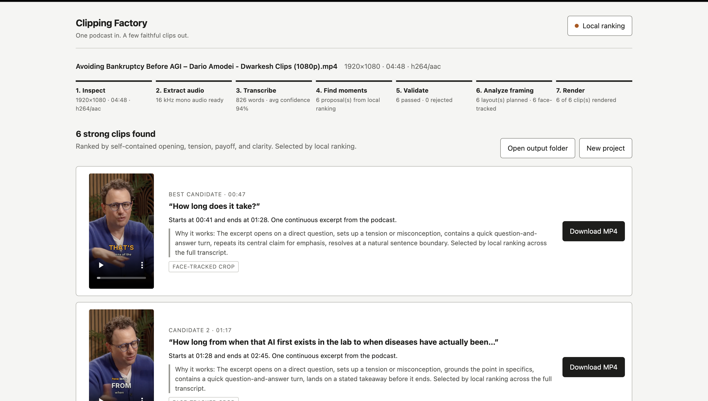
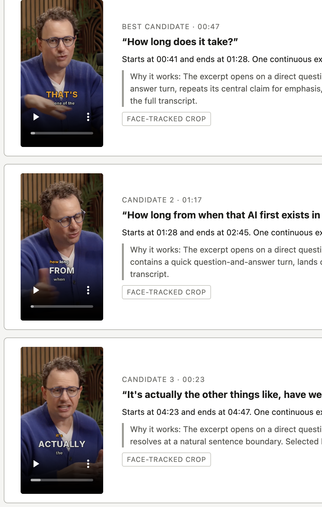

<div align="center">

# Clipping Factory

### One podcast in. Every strong, faithful clip out.

Local-first podcast clipping with transcript ranking, face-aware reframing, and
word-accurate captions. Built entirely in Rust.


</div>



Clipping Factory turns a podcast MP4 into as many **strong, distinct 1080×1920
vertical clips** as the source supports. Every result is one continuous excerpt
of the original conversation, with word-accurate captions and clean,
face-tracked framing.

No accounts. No cloud upload. No required AI model. The local ranking engine
scans the full transcript for strong openings, reactions, repeated claims,
specific insights, and clean payoffs. A deterministic validator rejects
context-dependent or overlapping moments before anything renders.

## What you get

| | |
|---|---|
| **More useful candidates** | Local ranking keeps every strong, sufficiently distinct moment instead of stopping at three. |
| **Faithful excerpts** | Speech is never rewritten, reordered, spliced, or invented. |
| **Feed-ready video** | H.264/AAC, 1080×1920, face-tracked crop or a safe blur-pad fallback. |
| **Karaoke captions** | Word-timestamped Impact and Clean caption styles with selectable accent colors. |
| **Private by default** | Video, audio, transcript, project state, and rendering stay on your Mac. |

<p align="center">
  
</p>

```
Drop MP4 → Inspect → Extract audio → Transcribe (whisper.cpp, word timestamps)
        → Find moments (local ranking, or optional OpenAI/Anthropic)
        → Deterministic quality validator → Face-aware framing analysis
        → Sequential FFmpeg renders → Preview & download each clip
```

---

## Quickstart (macOS, Apple Silicon)

Four commands, then it's a browser app:

```bash
# 1. Media + transcription runtimes
brew install ffmpeg-full whisper-cpp

# 2. Rust toolchain (skip if you have it)
curl --proto '=https' --tlsv1.2 -sSf https://sh.rustup.rs | sh

# 3. Transcription model (~148 MB, one time)
mkdir -p ~/.clipping-factory/models
curl -L -o ~/.clipping-factory/models/ggml-base.en.bin \
  "https://huggingface.co/ggerganov/whisper.cpp/resolve/main/ggml-base.en.bin"

# 4. Run the studio (from this repo's directory)
cargo run --release
```

The studio opens at **http://localhost:4571**. Drop one MP4 in. That's the product.

> **Linux:** identical, except install ffmpeg via your package manager and build
> [whisper.cpp](https://github.com/ggml-org/whisper.cpp) (`cmake -B build && cmake --build build -j --target whisper-cli`),
> then point `CF_WHISPER_BIN` at the built `whisper-cli` if it isn't on your PATH.

### Better transcription (optional)

`base.en` is fast and solid. For noticeably better captions on tricky audio, download
`ggml-small.en.bin` (~466 MB) into the same folder — it's picked up automatically —
or set `CF_WHISPER_MODEL` to any ggml model path.

---

## Local by default, AI optional

Local ranking needs no key and is the default. Open **Local ranking** in the
studio header if you want to connect an optional provider instead.

| Provider | Default model | Notes |
|---|---|---|
| Local ranking | — | No key needed. Scans the full transcript for reactions, repeated claims, strong hooks, and clean payoffs. |
| OpenAI | `gpt-4o-mini` | The PRD's primary provider. Any chat-completions model name works. |
| Anthropic | `claude-sonnet-4-5` | Alternative provider. |

Privacy posture (enforced in code):

- Your key is stored in `~/.clipping-factory/settings.json` with `0600` permissions — outside any project folder, never logged, never sent back to the browser.
- Only **transcript text** is sent to the provider. The video never leaves your machine.

---

## What the validator enforces (the anti-slop gate)

Every AI proposal must survive these deterministic rules before it renders
(all unit-tested in `src/validate.rs`):

- `self_contained ≥ 4`, `payoff ≥ 3`, `clarity ≥ 4`, `context_dependency ≤ 2`, `slop_risk ≤ 2`
- Duration 20–90 s (15–110 s allowed only for exceptionally-scored moments, flagged as exceptions)
- Opening & closing quotes must be **verbatim** in the transcribed excerpt, near its start/end
- Start/end snapped to real word timestamps — never trusting raw LLM milliseconds
- ≤ 30 % overlap with any higher-ranked clip
- Timestamps inside the source duration

Zero survivors is a valid result: the studio says no excerpt passed the bar, and the
**"What was considered and rejected"** panel shows each rejection with its named rule.

## Caption styles

Pick per-upload in the studio (or set the default with `CF_CAPTION_STYLE`):

- **Impact** (default) — kinetic stacked lockups. Each phrase renders as a tight,
  ragged stack: connective words small, the key word HUGE in caps, the currently
  spoken word tinted yellow, with a subtle pop-in per phrase. Built for
  short-form feeds.
- **Clean** — the restrained original: 3–7 word groups in the lower safe area,
  white with a soft outline, one amber accent on the active word.

## The house rendering rules (applied to both styles)

- 1080×1920 H.264/AAC MP4, source frame rate preserved (or 30 fps)
- **One persistent face** → smoothed, face-tracked vertical crop (rustface detection,
  moving-average smoothing, piecewise-linear crop path — no jitter, no crop through faces)
- **Two+ faces or no reliable face** → original framing centered over a blurred,
  darkened copy of itself (never guesses the active speaker)
- Captions: Inter, 3–7 word conversational groups in the lower safe area, white with
  soft outline, the currently-spoken word in one restrained amber accent
- Headline appears top-of-frame for the first 3.5 s **only when** it adds context beyond
  the opening words
- No emojis, no B-roll, no zoom patterns, no music, no transitions. Ever.

## Outputs & state

```
~/Downloads/Clipping Factory/<source-name>/   ← finished clips (01-headline-slug.mp4)
~/.clipping-factory/projects/<project-id>/    ← project.json, transcript.json,
                                                 candidates.json, render-manifest.json, clips/
```

Filesystem JSON only — no database. Temporary audio is deleted after transcription.
Refresh the browser mid-run and the studio restores progress; restart the server mid-run
and the project reports the interruption with a one-click **Retry** that resumes from the
last completed stage (finished clips are never re-rendered).

---

## Architecture (all Rust)

| | |
|---|---|
| Web server & API | axum 0.8 + tokio (SSE progress events, streaming multipart upload, Range-aware clip serving) |
| Media probe/extract/render | FFmpeg & FFprobe subprocesses, `-progress` parsing, kill-on-cancel |
| Transcription | whisper.cpp (`--max-len 1 --split-on-word`) → word timestamps + rebuilt sentence segments |
| Editorial selection | Local full-transcript ranking, or OpenAI / Anthropic with 12-minute overlapping transcript windows |
| Quality gate | Pure-Rust deterministic validator (`src/validate.rs`) |
| Framing | rustface (SeetaFace) over 1 fps sampled frames → layout decision + smoothed crop keyframes |
| Captions | Generated ASS subtitles burned by libass (`Inter`, bundled in `assets/fonts/`) |
| State | Filesystem JSON with atomic writes |

```
src/
  main.rs        boot, first-run checks       select/mod.rs      windowing, prompts, parsing
  api.rs         PRD §14.1 HTTP surface       select/openai.rs   OpenAI provider
  pipeline.rs    stage orchestrator           select/anthropic.rs Anthropic provider
  media.rs       ffprobe + audio extract      select/heuristic.rs offline selector
  transcribe.rs  whisper.cpp integration      validate.rs        deterministic quality gate
  frame.rs       face detect + layout         captions.rs        ASS builder (karaoke accent)
  render.rs      FFmpeg filtergraphs          store.rs / state.rs / settings.rs / config.rs
static/          the studio UI (served by the binary; embedded fallback)
```

### Configuration

Everything's overridable via environment variables: `CF_PORT`, `CF_DATA_DIR`, `CF_OUTPUT_DIR`,
`CF_FFMPEG`, `CF_FFPROBE`, `CF_WHISPER_BIN`, `CF_WHISPER_MODEL`, `CF_FONTS_DIR`,
`CF_FACE_MODEL`, `CF_THREADS`, `CF_BIND_ALL=1`, `CF_NO_OPEN=1`.

### Tests

```bash
cargo test   # 50 tests: every validator rule, caption pagination, crop math,
             # layout decisions, selector parsing, state recovery
```

---

## Deliberate deviations from the PRD's suggested stack

The PRD (§14) suggested Node/Express + React + Python faster-whisper + Remotion. This
implementation is **all Rust** by design — one static binary, no Node/Python runtimes:

| PRD suggestion | This build | Why |
|---|---|---|
| Node + Express | axum (Rust) | Single binary, lower memory on 4-hour sources, and the codebase drops straight into a Tauri desktop app for the post-MVP $5 product |
| Python `faster-whisper` | whisper.cpp | Best-in-class on Apple Silicon (Metal), no Python dependency, same models |
| Remotion renderer | FFmpeg filtergraphs + libass | 10–50× faster for a fixed restrained style (Remotion renders via headless Chrome), and sidesteps the Remotion commercial-license review the PRD itself flags (§21). If post-MVP you want animated caption packs, a Remotion sidecar can be added behind the same render interface. |
| OpenAI only | Local ranking + OpenAI + Anthropic | Strong keyless selection by default, with provider choice when wanted |

Product behavior follows the PRD: same stages, same API shape, same rubric and
thresholds, same outputs, same privacy rules.

## Credits & licenses

[FFmpeg](https://ffmpeg.org) (LGPL/GPL builds) · [whisper.cpp](https://github.com/ggml-org/whisper.cpp) (MIT) ·
[rustface](https://github.com/atomashpolskiy/rustface) (MIT, SeetaFace model) ·
[Inter](https://rsms.me/inter/) (SIL OFL 1.1, bundled) · Whisper models by OpenAI (MIT).

You are responsible for processing only content you own or have permission to use.
