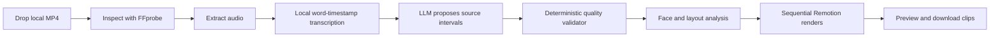

# Clipping Factory MVP PRD

Generated by `/office-hours` on 2026-07-01  
Status: DRAFT  
Mode: Builder  
Primary handoff: Fable 5

## 1. Product Summary

Clipping Factory is a local web studio that turns one long podcast MP4 into several finished vertical clips.

The user drops in a video, connects their own AI API key, waits while the app analyzes and renders the strongest moments, previews every result, and downloads whichever MP4s they like.

The product must not generate “AI slop.” It keeps the original podcast intact and applies a restrained, consistent visual treatment. The AI chooses different source moments; it does not fabricate speech, rewrite the conversation, splice sentences together, add unrelated B-roll, or cover weak excerpts with excessive effects.

## 2. Product Decision

Build a custom, quality-first MVP.

This is a complete clipping studio workflow, but not a general-purpose video editor:

1. Attach one podcast MP4.
2. Transcribe it locally.
3. Find and rank several strong, self-contained moments.
4. Convert each moment to a polished 9:16 clip.
5. Preview the rendered clips.
6. Download clips individually.

The MVP runs locally in a browser. It is not a hosted upload service or packaged desktop application yet.

The first supported environment is macOS on Apple Silicon. Cross-platform packaging is post-MVP work.

## 3. Problem

Long podcasts contain short moments worth sharing, but finding and packaging them requires:

- Watching or scanning the full recording.
- Identifying excerpts that make sense without earlier context.
- Choosing clean start and end points.
- Reframing horizontal footage for vertical platforms.
- Producing accurate, readable captions.
- Rendering and reviewing several candidates.

Existing AI clippers often optimize for output volume and visual activity. The result can contain arbitrary hooks, irrelevant B-roll, excessive zooms, inaccurate captions, or excerpts that do not resolve. Clipping Factory instead optimizes for editorial judgment and faithful presentation.

## 4. Goals

The MVP succeeds when it:

- Accepts one local MP4 without uploading the video to Clipping Factory servers.
- Handles speech-led MP4 sources up to four hours long when the machine has sufficient disk space.
- Produces several distinct clips from different moments in the source.
- Selects only excerpts that work as standalone ideas.
- Preserves one continuous section of the original recording in every clip.
- Creates polished 1080×1920 MP4s using one restrained house style.
- Lets the user preview and download each result independently.
- Makes every long-running stage and failure visible.

## 5. Non-Goals

Do not build these in the MVP:

- Hosted accounts, cloud uploads, teams, or authentication.
- Payments or the proposed $5 purchase flow.
- A packaged macOS or Windows desktop application.
- Multiple source files in one project.
- Batch project queues.
- A timeline editor.
- Internal jump cuts or removal of filler words.
- Sentence reordering, voice cloning, or rewritten speech.
- Stock footage, generated B-roll, generated images, or generated video.
- Automatic music, sound effects, or emojis.
- Multiple caption templates or visual themes.
- Social scheduling or automatic posting.
- Download-all ZIP files.
- Claims that a clip has a measurable probability of going viral.

These exclusions are deliberate. The first release must prove that the selected moments and finished clips are consistently good.

## 6. Core Product Principles

### 6.1 Faithful source

Each clip is one continuous interval from the original podcast.

- The app may choose only `start_time` and `end_time`.
- Spoken words must not be removed, reordered, duplicated, or generated.
- Original audio remains continuous.
- The final transcript must map directly to the source timestamps.

### 6.2 Quality over quota

The target is roughly one candidate per ten minutes of source material, but this is not a quota.

- Weak moments must be rejected.
- Short videos may produce one or zero clips.
- Strong long videos may produce more than the target.
- The result screen must state when no excerpt passes the quality bar.

### 6.3 Natural duration

Clips normally run 20–90 seconds.

- Start on a sentence or natural conversational boundary.
- Include enough context to understand the point immediately.
- End after the idea, story, joke, or argument resolves.
- Do not pad an excerpt merely to reach a target duration.

### 6.4 Restrained visual treatment

Every visual change must improve readability, framing, or emphasis.

- No visual element is added only to create motion.
- No external footage is introduced.
- Captions and framing must remain consistent across every output.
- The product should feel like a competent human editor made a deliberate template once.

## 7. Primary User Flow

### 7.1 First run

1. User runs `npm run app`.
2. The local server starts and opens the studio in the default browser.
3. A first-run check verifies FFmpeg, FFprobe, the transcription runtime, and available disk space.
4. If the transcription model is missing, the app explains its size and shows download progress.
5. The user opens **AI connection**, enters an OpenAI API key, and tests it.
6. The key is sent to the local backend, stored outside the project directory with user-only file permissions, and never returned to or logged by the UI.

### 7.2 Create clips

1. User drops one `.mp4` into the studio or selects it through the file picker.
2. The local server streams the file to project storage without buffering the complete video in memory.
3. The app validates the container, codecs, duration, audio stream, dimensions, and file readability.
4. The app creates a project and displays the source filename and duration.
5. Processing begins automatically:
   - Inspect source
   - Extract audio
   - Transcribe
   - Find moments
   - Validate candidates
   - Analyze framing
   - Render clips
6. The interface shows the current stage, stage progress, elapsed time, and errors.
7. Rendered clips appear one at a time as soon as they are ready.

### 7.3 Review results

Each result row shows:

- Rank.
- Generated headline.
- Duration.
- Original source start and end timestamps.
- Vertical video preview.
- Short explanation of why the excerpt was selected.
- **Download MP4** action.

The candidates are different moments from the podcast, not alternate visual versions of the same moment.

## 8. Screen Requirements

The MVP has one studio screen with three states.

### 8.1 Empty state

- Product name.
- **AI connection** button and connection status.
- Large drop target for one MP4.
- Clear statement that processing happens locally.
- Supported-input note: MP4 with at least one audio stream.

### 8.2 Processing state

- Source filename, duration, and resolution.
- Ordered stage list.
- Current stage and progress.
- Number of candidate moments that passed validation.
- Number of rendered clips ready.
- Cancel button.
- Actionable failure message and **Retry stage** button.

The UI must never appear frozen. If exact percentage is unavailable, show the current operation and elapsed time.

### 8.3 Results state

- Count of clips found.
- Ranked clip rows.
- Inline playback with native controls.
- Selection rationale.
- Individual download button.
- **Open output folder** button.
- A clear empty result when no moment passes the rubric.

The reference wireframe is [WIREFRAME.html](./WIREFRAME.html).

## 9. Editorial Selection Engine

### 9.1 Candidate generation

The LLM receives:

- The timestamped transcript.
- Source duration.
- A target candidate count based on source duration.
- The editorial rubric.
- Explicit instructions to return only contiguous source intervals.

For long transcripts, process overlapping transcript windows, merge candidates, then run one final ranking pass over the shortlist.

Use this planning target:

```text
target_count = max(1, round(source_duration_minutes / 10))
proposal_count = max(3, ceil(target_count * 1.5))
```

`target_count` guides ranking but is not a required final count. The final count is whatever survives validation, including zero. Snap accepted start and end values to real word timestamps rather than trusting arbitrary millisecond values returned by the LLM.

### 9.2 Required structured output

Each proposed candidate must include:

```json
{
  "start_ms": 1122000,
  "end_ms": 1188000,
  "headline": "Why discipline fails when it depends on motivation",
  "opening_quote": "Most people think discipline means...",
  "closing_quote": "That is what makes the habit sustainable.",
  "selection_reason": "The opening establishes a misconception and the ending resolves it.",
  "scores": {
    "self_contained": 5,
    "opening_strength": 4,
    "specificity": 4,
    "tension_or_novelty": 4,
    "payoff": 5,
    "clarity": 5,
    "context_dependency": 1,
    "slop_risk": 1
  }
}
```

Scores use a 1–5 scale except penalties, where 1 is safest and 5 is worst.

### 9.3 Editorial rubric

A passing clip must:

- Make sense without the preceding conversation.
- Establish its subject within the opening sentence or first few seconds.
- Contain a specific insight, story, disagreement, reveal, joke, or useful explanation.
- Build toward a payoff or clear conclusion.
- End cleanly without cutting off the next necessary sentence.
- Preserve the speaker’s actual meaning.
- Avoid references such as “like I said earlier” unless the excerpt supplies the missing context.
- Avoid sponsor reads, housekeeping, introductions, and generic agreement.

Reject a candidate when:

- `self_contained < 4`
- `payoff < 3`
- `clarity < 4`
- `context_dependency > 2`
- `slop_risk > 2`
- Duration falls outside 20–90 seconds without an explicit validator exception.
- Its interval overlaps more than 30% with a higher-ranked candidate.
- The supplied opening or closing quote cannot be found in the timestamped transcript.

### 9.4 Headline rules

The headline is visual metadata, not replacement speech.

- It may summarize the excerpt.
- It must be supported directly by what the speaker says.
- It must not invent numbers, certainty, conflict, or claims.
- It should use sentence case.
- It should normally stay under 90 characters.
- It is displayed in the results UI and may appear as restrained top-of-frame text.

Do not display a fake “virality percentage.”

## 10. Transcription

- Run transcription locally with word-level timestamps.
- Use a high-accuracy English model by default.
- Preserve punctuation and sentence boundaries where possible.
- Store both raw word timestamps and normalized transcript segments.
- Never silently replace uncertain words with invented text.
- Caption text may normalize obvious punctuation and casing but must preserve spoken wording.

If transcription confidence is low, surface the warning on affected clips rather than hiding it.

## 11. Video Composition

### 11.1 Output

- Container: MP4.
- Video: H.264.
- Audio: AAC.
- Resolution: 1080×1920.
- Frame rate: preserve the source frame rate when practical; otherwise use 30 fps.
- Preserve original audio timing and pitch.

### 11.2 Framing

Analyze faces across the candidate interval before rendering.

- **One persistent face:** use a smoothed vertical crop centered on the face with safe headroom.
- **Two or more persistent faces:** place the uncropped source inside the vertical canvas over a blurred background. Do not guess the active speaker in the MVP.
- **No reliable face:** use the same uncropped-source-over-blurred-background layout.
- Avoid rapid crop movement. Camera position changes must be smoothed.
- Never crop through a face or place captions over the speaker’s mouth.

### 11.3 House style

- Neutral dark background.
- Original video is the dominant visual.
- One readable sans-serif typeface.
- High-contrast captions in the lower safe area.
- Captions display short conversational groups, normally 3–7 words.
- The currently spoken word may use one restrained accent color.
- Headline appears only when it improves immediate context.
- No emojis.
- No meme graphics.
- No stock or generated B-roll.
- No automatic music or sound effects.
- No random transitions.
- No repeated punch-in zoom pattern.

## 12. Rendering Behavior

- Use Remotion compositions for the final clips.
- Render candidates sequentially to control local CPU, memory, and disk pressure.
- Show each completed clip immediately while later clips continue rendering.
- A failed render must not discard successful outputs.
- Retry only the failed candidate when possible.
- Final output filenames use:

```text
01-why-discipline-fails.mp4
02-the-mistake-that-ended-the-experiment.mp4
```

- Outputs are written to:

```text
~/Downloads/Clipping Factory/<source-name>/
```

## 13. Local Data and Privacy

Project state lives in:

```text
~/.clipping-factory/projects/<project-id>/
  project.json
  transcript.json
  candidates.json
  render-manifest.json
  clips/
```

Rules:

- Do not copy the source MP4 unless required by the browser upload mechanism.
- Delete temporary extracted audio after successful transcription.
- Never log API keys.
- Send transcript text, not the source video, to the LLM used for candidate selection.
- Tell the user that transcript text is sent to their selected AI provider.
- Provide a project-level delete action only if it is needed to clear generated data during development; a project library UI is not part of the MVP.

Users are responsible for processing content they own or have permission to use.

## 14. Technical Architecture

Recommended stack:

- React and TypeScript for the studio UI.
- Vite for the frontend build.
- Node.js and Express for the local server.
- Server-sent events for progress updates.
- FFmpeg and FFprobe for media inspection, extraction, trimming, and encoding support.
- `faster-whisper` in a Python worker for local word-timestamp transcription.
- OpenAI API for candidate selection, using the user’s key.
- A face detector plus smoothed tracking for framing.
- Remotion for composition and rendering.
- Filesystem JSON for project state; no database.



### 14.1 Suggested local API

```text
POST   /api/settings/ai/test
POST   /api/projects
GET    /api/projects/:id
GET    /api/projects/:id/events
POST   /api/projects/:id/process
POST   /api/projects/:id/cancel
POST   /api/projects/:id/retry
GET    /api/projects/:id/clips/:clipId
GET    /api/projects/:id/clips/:clipId/download
POST   /api/projects/:id/open-output-folder
```

### 14.2 Job states

```text
created
inspecting
extracting_audio
transcribing
selecting_candidates
validating_candidates
analyzing_layout
rendering
complete
cancelled
failed
```

Each state records `started_at`, `completed_at`, progress details, and a recoverable error when applicable.

## 15. Error and Edge Cases

The MVP must handle:

- Invalid or corrupted MP4.
- Missing audio stream.
- Unsupported codec.
- Video shorter than 20 seconds.
- Video with no useful speech.
- Transcript with no passing candidates.
- AI key missing, invalid, or rate-limited.
- Malformed LLM JSON.
- Candidate timestamps outside the source duration.
- Overlapping or duplicate candidates.
- Transcription model missing.
- FFmpeg or FFprobe missing.
- Insufficient disk space.
- Render process crash.
- Browser refresh during processing.
- User cancellation.
- Portrait source video.
- No detectable face.
- More than two visible faces.

Errors must name the failed stage and state what the user can do next.

Cancellation must terminate the active FFmpeg, transcription, or rendering subprocess, prevent new render jobs from starting, and preserve clips that already completed.

## 16. Acceptance Criteria

### 16.1 Functional

- A user can launch the studio with one command.
- A valid MP4 can be attached without creating an account.
- The app produces a timestamped local transcript.
- Every candidate maps to one continuous source interval.
- Every candidate is between 20 and 90 seconds unless explicitly marked as an allowed exception.
- Candidates are ranked and explain why they were selected.
- Every passing candidate renders to a playable 1080×1920 MP4.
- Completed renders appear before the entire queue finishes.
- Each result can be previewed and downloaded independently.
- Refreshing the browser restores current project progress.
- A failed candidate render can be retried without rerunning successful candidates.

### 16.2 Anti-slop quality gate

Test with at least three clear, speech-led podcast videos that the tester has permission to use.

- 100% of output clips preserve continuous source audio.
- 100% of headlines are supported by the excerpt.
- 100% of outputs contain no external B-roll, generated imagery, emojis, or invented speech.
- At least 80% of top-ranked candidates make sense without watching the prior 30 seconds.
- At least 80% of top-ranked candidates reach a clear payoff before ending.
- Caption word accuracy is at least 95% on clear English speech.
- Caption timing drift remains under 150 ms for the tested clips.
- Faces remain inside the safe crop in at least 95% of sampled frames.
- The user would choose to download at least three of the top five candidates from one strong 60-minute test source.

If the final criterion fails, do not add more effects. Improve the editorial prompt, transcript windowing, ranking, and deterministic validator.

### 16.3 Operational

- No API key appears in browser logs, server logs, project JSON, or error traces.
- Temporary audio is removed after successful transcription.
- Processing progress remains visible during every long-running stage.
- Cancellation stops new work and leaves already completed clips playable.
- Automated tests cover candidate validation, timestamp bounds, overlap removal, project-state recovery, and download behavior.

## 17. Implementation Order

Build and verify one vertical slice at a time.

1. **Local shell and import**
   - Studio UI, Express server, MP4 validation, project filesystem.
   - Verify with valid and invalid MP4 fixtures.
2. **Transcription**
   - Audio extraction, local model setup, word timestamps, progress.
   - Verify timestamps against a short known transcript.
3. **Candidate selection**
   - LLM schema, editorial prompt, long-transcript windowing, ranking.
   - Verify every quote and timestamp against the transcript.
4. **Deterministic validation**
   - Duration, boundaries, overlap, quote matching, score thresholds.
   - Unit-test every rejection rule.
5. **Basic rendering**
   - Continuous source interval, 9:16 canvas, original audio, captions.
   - Verify audio sync and output codec.
6. **Framing**
   - Single-face crop, multi-face fallback, smoothing, caption safe areas.
   - Verify on single-speaker, two-speaker, and no-face fixtures.
7. **Results studio**
   - Incremental clip cards, playback, rationale, download, open folder.
   - Verify browser refresh and partial render failures.
8. **Quality evaluation**
   - Run the anti-slop test set.
   - Tune selection and validation until acceptance criteria pass.

## 18. Definition of Done

The MVP is done when a user can attach one long podcast MP4 and, without editing a timeline, receive several ranked, faithful, polished vertical clips that they can preview and download individually.

“Several” means the number of excerpts that pass the quality gate, with roughly one candidate per ten minutes as a planning target. The app must be willing to return fewer clips rather than return bad ones.

## 19. Post-MVP

Only after the anti-slop acceptance criteria pass:

1. Package the local studio as a desktop application.
2. Add a simple one-time $5 license flow.
3. Add project history and deletion controls.
4. Consider optional user-controlled caption customization.
5. Consider multiple source files.

Do not add B-roll generation, auto-posting, style marketplaces, or a full timeline editor until real usage shows they are necessary.

## 20. Known Assumptions

- MVP supports English speech.
- MVP supports macOS on Apple Silicon.
- MVP accepts any MP4 streams that the installed FFmpeg build can decode, with a supported duration of up to four hours.
- MVP supports OpenAI for editorial selection.
- The user runs the tool on a machine capable of local transcription and video rendering.
- Payment is deferred until quality is demonstrated.
- Different outputs are different source moments, not multiple edits of one moment.
- The reference “Joe Rogan clip” describes the desired podcast format; test and production inputs must be content the user has permission to process.

## 21. Source Notes

- [ClipsAI](https://github.com/ClipsAI/clipsai) demonstrates transcript-based clipping and speaker-aware reframing under an MIT license.
- [Podcli](https://podcli.com/open-source-opusclip-alternative) demonstrates that the generic local clipping pipeline already exists; its AGPL license means its code should not be copied into a closed paid product without appropriate licensing.
- [Remotion](https://github.com/remotion-dev/remotion) is the selected programmatic renderer. Review its current license before commercial release and use it as a dependency rather than selling a modified Remotion derivative.
